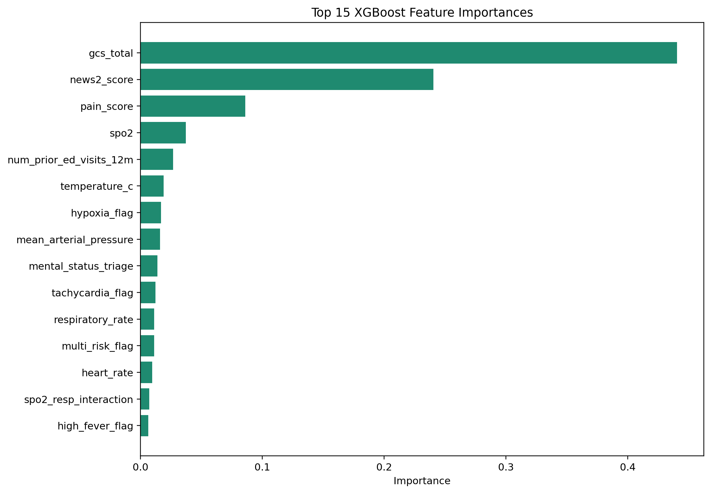
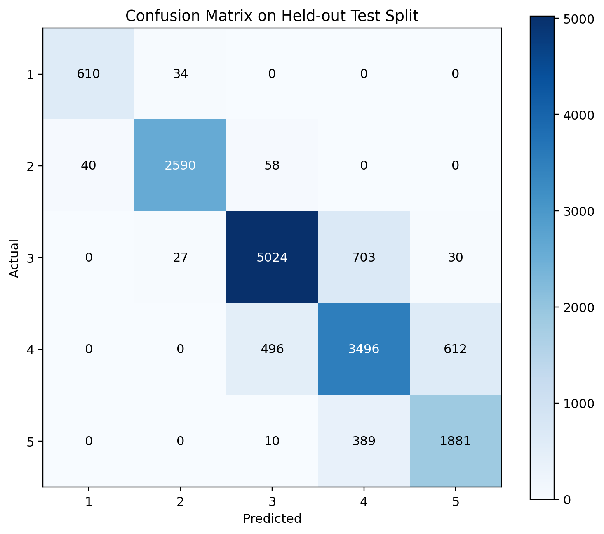
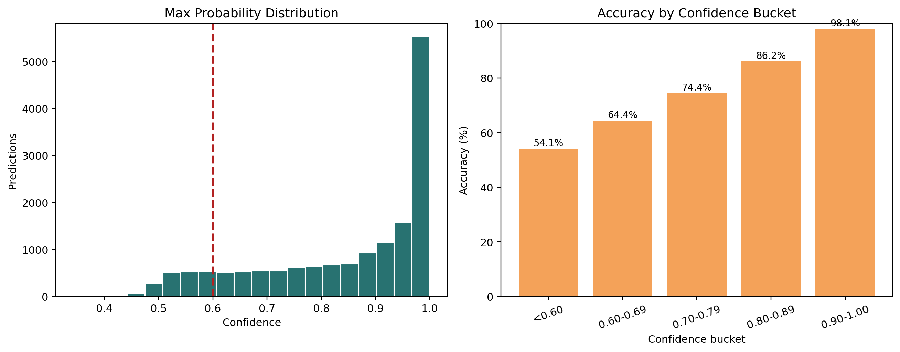
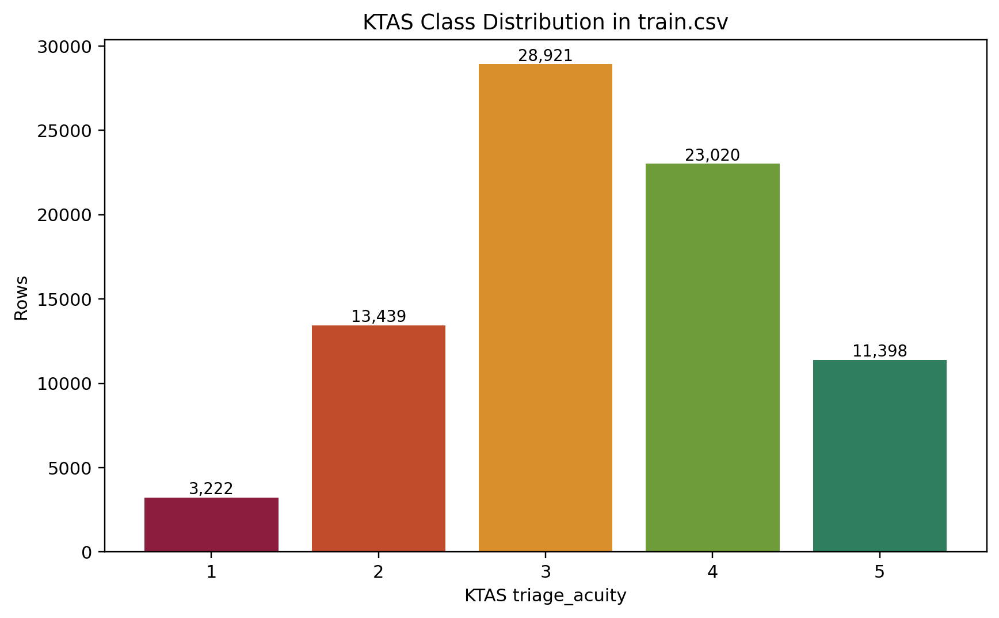
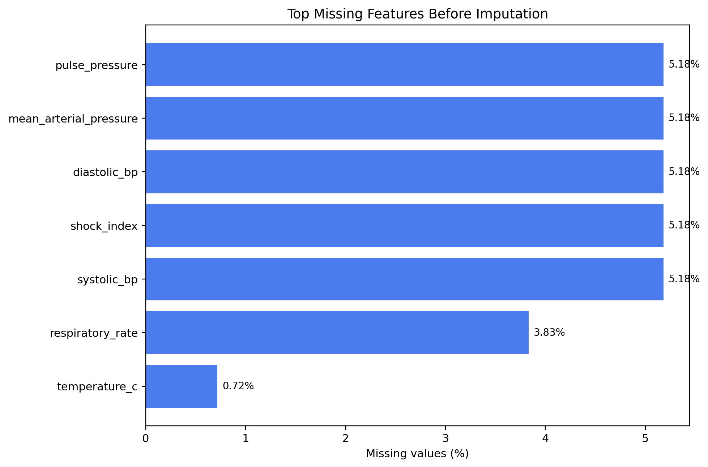
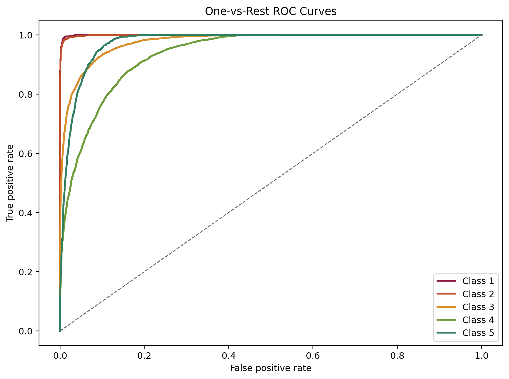

# SmartQ ML Service: v3 Model Evaluation

## What This Model Checks

- The model predicts KTAS triage acuity from structured arrival-time data, not free-form text alone.
- It looks at vitals, neurological status, pain, oxygenation, hemodynamic stability, arrival context, and recent emergency-care utilization.
- It also derives secondary risk signals inside the service, including `shock_index`, `mean_arterial_pressure`, `pulse_pressure`, `spo2_resp_interaction`, `hypoxia_flag`, `high_fever_flag`, `tachycardia_flag`, and `multi_risk_flag`.

## What Most Influences the Score

- The strongest drivers in the saved v3 model are neurological status (`gcs_total`), the NEWS2 severity score, pain severity, oxygen saturation, prior ED visits, temperature, and blood-pressure-derived risk signals.
- This means the score moves most when the patient shows clear physiological instability or abnormal alertness.

| feature | importance |
| --- | --- |
| gcs_total | 0.440424 |
| news2_score | 0.240464 |
| pain_score | 0.086036 |
| spo2 | 0.037325 |
| num_prior_ed_visits_12m | 0.026695 |
| temperature_c | 0.01914 |
| hypoxia_flag | 0.016806 |
| mean_arterial_pressure | 0.016057 |
| mental_status_triage | 0.01392 |
| tachycardia_flag | 0.012275 |
| respiratory_rate | 0.011274 |
| multi_risk_flag | 0.011244 |
| heart_rate | 0.009611 |
| spo2_resp_interaction | 0.007266 |
| high_fever_flag | 0.006301 |



## How Accurate It Is

- Accuracy: **85.01%**
- Weighted ROC-AUC: **0.9697**
- Macro F1: **0.8681**
- Weighted F1: **0.8509**
- Weighted Precision: **0.8524**
- Weighted Recall: **0.8501**
- Low-confidence share at `< 0.60`: **11.93%**
- Total mistakes on the held-out split: **2,399 / 16,000**
- Adjacent errors (`|pred-actual| = 1`): **2,359**
- Dangerous errors (`|pred-actual| >= 2`): **40**
- Improvement over old baseline accuracy (0.8499): **+0.02 percentage points**

### Per-Class Performance

- KTAS 1 recall: **0.9472**
- KTAS 2 recall: **0.9635**
- KTAS 3 recall: **0.8686**
- KTAS 4 recall: **0.7593**
- KTAS 5 recall: **0.8250**
- Macro F1 shows balanced multiclass behavior at **0.8681**.

| class | precision | recall | f1_score | support |
| --- | --- | --- | --- | --- |
| 1 | 0.9385 | 0.9472 | 0.9428 | 644 |
| 2 | 0.977 | 0.9635 | 0.9702 | 2688 |
| 3 | 0.8991 | 0.8686 | 0.8836 | 5784 |
| 4 | 0.762 | 0.7593 | 0.7607 | 4604 |
| 5 | 0.7455 | 0.825 | 0.7833 | 2280 |



## What the Confidence Flag Means

- `low_confidence = true` is triggered when the model's highest class probability is below **0.60**.
- That flag catches **1,909** of **16,000** held-out predictions.
- Accuracy is only **54.1%** below the threshold, but rises to **98.1%** in the `0.90-1.00` confidence bucket.
- In practice, this makes the flag useful for manual review and conservative routing.

| bucket | count | accuracy |
| --- | --- | --- |
| <0.60 | 1909 | 0.5411 |
| 0.60-0.69 | 1623 | 0.6445 |
| 0.70-0.79 | 1812 | 0.7445 |
| 0.80-0.89 | 2323 | 0.8618 |
| 0.90-1.00 | 8333 | 0.9806 |



## What It Does Not Do

- It does not explain *why* a patient feels unwell in natural language; it maps structured triage inputs to an acuity class.
- It does not predict queue wait time or doctor consultation duration. That requires SmartQ's own timing data and a separate ETA model.
- It does not replace clinician judgment. It should be used as a decision-support signal with guardrails and low-confidence review.

## Why SmartQ Uses a Trained Model Instead of Prompt-Only AI Scoring

- A trained tabular model is deterministic: the same vitals produce the same score every time.
- It is measurable: we can report accuracy, ROC-AUC, class-wise recall, and dangerous-error counts.
- It is cheaper and faster than sending every triage request to a large language model.
- It is also easier to audit, because we can see which structured variables influence the prediction.

## Dataset Snapshot

- Primary modeling table: `train.csv` with 80,000 rows and 40 columns.
- Supplementary table: `chief_complaints.csv` with 100,000 rows.
- Supplementary table: `patient_history.csv` with 100,000 rows.
- Held-out unlabeled package file: `test.csv` with 20,000 rows.
- Runtime model family: tuned `XGBoost` multiclass classifier with 40 selected features and SMOTE applied during training.

## Class Balance

| class | rows | share_pct |
| --- | --- | --- |
| 1 | 3222 | 4.03 |
| 2 | 13439 | 16.8 |
| 3 | 28921 | 36.15 |
| 4 | 23020 | 28.78 |
| 5 | 11398 | 14.25 |



## Missingness Snapshot

| feature | missing_pct |
| --- | --- |
| systolic_bp | 5.18 |
| diastolic_bp | 5.18 |
| mean_arterial_pressure | 5.18 |
| pulse_pressure | 5.18 |
| shock_index | 5.18 |
| respiratory_rate | 3.83 |
| temperature_c | 0.72 |



## Error Pattern

- Most mistakes are adjacent KTAS levels, which is expected in ordinal acuity tasks where the boundary between classes 2/3/4 is clinically noisy.
- The dangerous-error rate is **0.25%** of held-out predictions, which is low but important enough to justify retaining the low-confidence flag and human override path.

## One-vs-Rest ROC Curves



## Consistency Check Against the Current FastAPI Service

- Replaying the held-out split with the saved training-style `multi_risk_flag` gives **85.01%** accuracy.
- Replaying the same split while swapping `multi_risk_flag` to the **current FastAPI service definition** gives **85.01%** accuracy.
- The `multi_risk_flag` value changes on **0.00%** of held-out rows.
- After alignment, these numbers should match. Any future non-zero mismatch here should be treated as training-vs-inference drift.

## Improvement Opportunities

- Add probability calibration checks and drift monitoring once SmartQ starts collecting real queue data.
- Collect SmartQ visit outcomes so the model can be revalidated on your own population instead of only on the source dataset split.
- Add explicit audit logging for low-confidence cases, manual overrides, and final doctor-reviewed disposition.
- For future ETA modeling, train a separate regression/forecasting stack instead of reusing this triage dataset. This dataset is strong for acuity, not queue wait time.

## Repro Commands

```bash
cd ml_service
python3 -m venv .venv
source .venv/bin/activate
pip install -r requirements-dev.txt
python evaluate_saved_model.py
```

Structured metrics are also saved to `reports/latest_model_metrics.json`.
